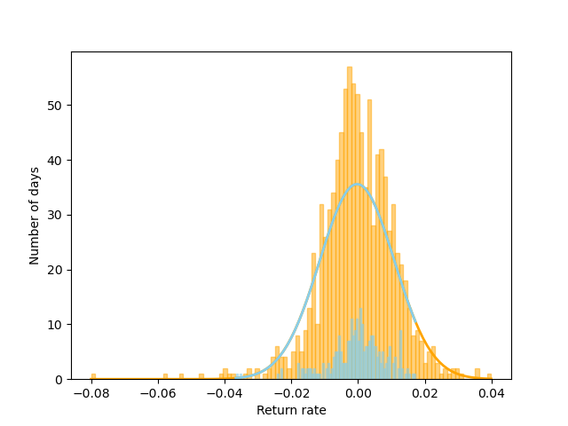

# Assignment1

VaR calculation for Google stock price using Monte Carol simulation

## data division
The data is divided in 3 groups to study the change of pice and VaR movement
1. the first 1000 daily price
2. the remaining data except the first 1000 daily price
3. the whole data set and comparing the first 1000 and the rest

## method used
1. Historical method
2. Variance-covariance method
3. Monte Carlo simulation method

## VaR result
1. Historical method:0.016753226970063914
2. Variance-covariance method:0.017884858727120267 
3. Monte Carlo simulation method:0.01761303532328897

simulation result from variance-covariance method and Monte Carlo simulation method is close while that from historical method is lower, leading to a lower VaR.

